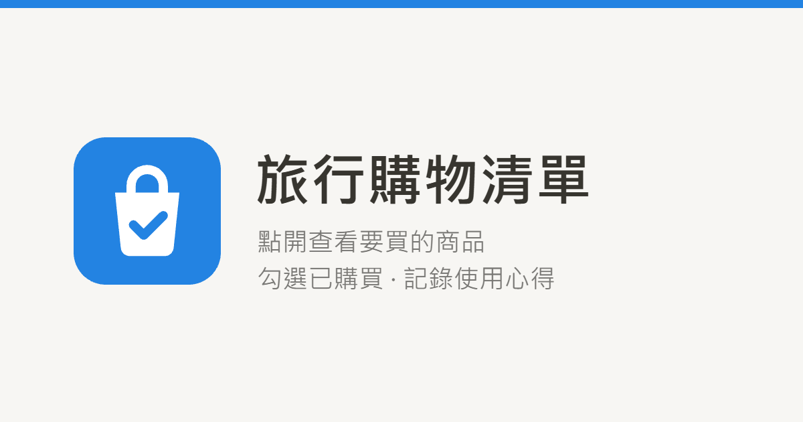

# 🛍️ 旅行購物清單 ShoppingList

**繁體中文** | [English](README.en.md)

把 Notion 裡規劃好的出國購物清單，一鍵轉換成**手機好用的購物網站**，並用密碼分享給旅伴。  
在賣場裡單手就能查看「還沒買」的商品、勾選已購買、寫下使用心得、新增欲購買的商品，所有變更都會即時同步回 Notion 的資料庫中。



## 功能

- **轉換器**：貼上 Notion 資料庫網址 → 檢查是否符合模板 → 設定清單密碼 → 取得分享網址
- **手機清單頁**
  - 預設只顯示「未購買」，可切換已購買 / 全部
  - 依種類、購買地點（Tag）、需要的人、需要程度篩選；依需要程度、單價、名稱、品牌排序；關鍵字搜尋
  - 一鍵標記已購買（可復原）、填寫評分與心得，同步寫回 Notion
  - 在手機上新增商品，並可直接拍照或從相簿上傳商品照片（既有商品也能補照片）
    - Android 手機的選擇畫面沒有「拍照」選項，請先用相機拍好，再從相簿選取
  - 商品圖片點擊放大、備註保留粗體與連結、推薦來源按鈕、「在 Notion 開啟」
  - 商品名稱開頭的【】自動視為品牌
  - 深色 / 淺色模式、安裝到手機主畫面、切換多個清單
  - 分享網址時顯示預覽縮圖
- **每個清單各自一組密碼**；轉換器另有管理密碼，只有你能建立與管理分享網址
- **不需要資料庫伺服器**：商品與轉換紀錄都存在你自己的 Notion
- **免費**：Vercel Hobby 方案 + Notion 免費方案即可運作

## 運作方式

```
手機瀏覽器 ──▶ Vercel Serverless API（保管 Notion Token 與密碼）──▶ Notion API
                                                              ├─ 各趟行程的「購物清單」資料庫
                                                              └─「轉換紀錄」資料庫
```

每個人都部署**自己的一份**網站，使用**自己的** Notion Integration，資料彼此完全分開。

## 開始使用（約 15 分鐘）

### 1. 複製 Notion 模板

打開 [旅行購物清單模板](https://about-travel.notion.site/Travel-Shopping-List-Template-b50c74f1eb1c8356b81f01a9bb2ae0fd)，點右上角「**複製 / Duplicate**」到你的工作區。
模板內有兩個資料庫：

- **購物清單**：每趟旅行複製一份來用
- **轉換紀錄**：由網站自動管理，保持空白即可

> ⚠️ 請不要修改欄位名稱與型別，網站依賴這些欄位。選項（例如 Tag 的購買地點、需要的人）可以自由新增或修改。

### 2. 建立 Notion Integration

1. 打開 <https://www.notion.so/profile/integrations>，點「**New integration**」
2. Type 選 **Internal**，Workspace 選你複製模板的工作區
3. 在 **Capabilities** 勾選：Read content、Update content、Insert content
4. 複製 **Internal Integration Secret**（`ntn_` 開頭），稍後用於 `NOTION_TOKEN`
5. 回到剛複製的模板頁面，點右上角「**⋯ → Connections**」，加入這個 Integration

> 之後在這個頁面底下複製出來的新清單，都會自動繼承存取權限。

### 3. 取得「轉換紀錄」資料庫 ID

在 Notion 打開「轉換紀錄」資料庫（以整頁開啟），複製網址。網址中 `?` 前面那段 32 碼的英數字就是資料庫 ID，例如：

```
https://www.notion.so/xxxx/0123456789abcdef0123456789abcdef?v=...
                           └────────── 資料庫 ID ──────────┘
```

### 4. 部署到 Vercel

[](https://vercel.com/new/clone?repository-url=https%3A%2F%2Fgithub.com%2Fluyachien%2FShoppingList&project-name=shopping-list&repository-name=shopping-list&env=NOTION_TOKEN%2CNOTION_REGISTRY_DATABASE_ID%2CADMIN_PASSWORD%2CSESSION_SECRET&envDescription=Notion%20token%2C%20registry%20database%20ID%2C%20admin%20password%20and%20a%20random%20session%20secret&envLink=https%3A%2F%2Fgithub.com%2Fluyachien%2FShoppingList%2Fblob%2Fmain%2FREADME.en.md%23environment-variables)

點上方按鈕（沒有 Vercel 帳號的話，可以直接用 GitHub 帳號註冊），依畫面填入下列環境變數後部署：

#### 環境變數

| 名稱 | 說明 |
|---|---|
| `NOTION_TOKEN` | 步驟 2 取得的 Integration Secret |
| `NOTION_REGISTRY_DATABASE_ID` | 步驟 3 取得的「轉換紀錄」資料庫 ID |
| `ADMIN_PASSWORD` | 轉換器的管理密碼，只有你知道 |
| `SESSION_SECRET` | 至少 32 字元的隨機字串，用來簽署登入狀態 |

`SESSION_SECRET` 可以用以下任一方式產生：

```bash
openssl rand -hex 32
# 或
node -e "console.log(require('crypto').randomBytes(32).toString('hex'))"
```

> 🔒 這些值只存在 Vercel 的環境變數中，**不要**寫進程式碼或提交到 Git。

### 5. 轉換第一個清單

1. 打開 Vercel 給你的網址（例如 `https://shopping-list-xxxx.vercel.app`），輸入管理密碼
2. 貼上 Notion「購物清單」資料庫的網址，按「**轉換**」
3. 設定這個清單的密碼，按「**建立分享網址**」
4. 把網址和密碼傳給旅伴

## 使用教學

有截圖、逐步說明每個功能的圖文教學（放在 Notion）：

- 📱 [手機購物清單使用教學](https://about-travel.notion.site/ccdc74f1eb1c83f1b07c01d0e611137b)：給旅伴與自己，說明查看清單、篩選與搜尋、勾選已購買、寫心得、新增商品與照片、安裝到主畫面等
- ⚙️ [購物清單轉換器使用教學](https://about-travel.notion.site/6e9c74f1eb1c8231b757016180a0d340)：給清單擁有者，說明轉換 Notion 資料庫、設定密碼、分享網址、停用清單

English versions: [Mobile Shopping List — User Guide](https://about-travel.notion.site/Mobile-Shopping-List-User-Guide-0e2c74f1eb1c82ff9763011a49504df1) · [Shopping List Converter — Owner's Guide](https://about-travel.notion.site/Shopping-List-Converter-Owner-s-Guide-795c74f1eb1c8345b5798130356926bf)

## 常見問題

**1. 轉換時顯示「找不到資料庫」？**  
請確認該資料庫所在的頁面（或上層頁面）已在「⋯ → Connections」加入你的 Integration。

**2. 轉換時顯示欄位缺少或型別錯誤？**  
網站只支援模板的欄位結構。必要欄位為「商品名稱、狀態、評分、種類」；「狀態」必須有「未購買」與「已購買」兩個選項。

**3. iPhone 如何安裝到主畫面？**  
用 Safari 開啟清單 → 點分享 → 「加入主畫面」。主畫面 App 與 Safari 的登入狀態不共用，第一次開啟需要再輸入一次清單密碼。

**4. 分享網址的預覽圖沒有出現？**  
LINE、Messenger 等 App 會快取預覽。可在網址後加上 `?v=2` 之類的參數重新傳送。

**5. 別人拿到分享網址能做什麼？**  
沒有清單密碼就無法查看或修改。  
網站只會修改「狀態」與「評分」，以及新增商品；不會刪除任何資料。  
「在 Notion 開啟」按鈕能否看到內容由 Notion 權限決定；若資料庫在 Notion 中「發布到網路」，任何人都能唯讀瀏覽。

## 本機開發

需要 Node.js 22 以上，沒有任何 npm 相依套件。

```bash
cp .env.example .env.local   # 填入上方的環境變數
npm run dev                  # http://localhost:3000
```

主要檔案：

| 路徑 | 用途 |
|---|---|
| `api/admin.js` | 轉換器與清單管理 API |
| `api/list.js` | 清單頁、登入、讀取 / 新增 / 更新商品 |
| `api/_lib/template.js` | Notion 模板欄位定義（欄位名稱只出現在這裡） |
| `public/` | 前端（純 HTML / CSS / JavaScript，無打包工具） |
| `scripts/dev.mjs` | 模擬 Vercel 路由的本機伺服器 |

## 授權

[MIT](LICENSE)
